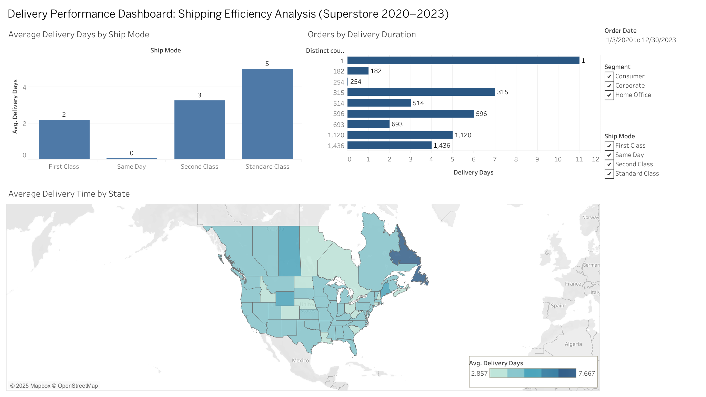

# 📊 Superstore Sales Analysis — Tableau Project

## 🧠 Project Overview
This project explores the **Superstore Sales dataset** using **Tableau** to analyze business performance across multiple dimensions — including **profitability, shipping times, and customer behavior**.  
It was created as part of a hands-on data visualization assignment, with focus on storytelling, dashboard design, and interactivity.

---

## 🚀 Objectives
1. **Analyze Profitability**
   - Compare profit percentages across categories, sub-categories, and shipping modes.
   - Use color scales to highlight high and low performing segments.
2. **Investigate Shipping Performance**
   - Calculate delivery time (days between Order Date and Ship Date).
   - Visualize average delivery days by Ship Mode, order counts by delivery duration, and map average delivery time by state.
3. **Build an Interactive Dashboard**
   - Combine all visualizations into a single dashboard.
   - Add filters for *Order Date*, *Segment*, and *Ship Mode*.
   - Integrate interactive elements with Actions and Parameters.

---

## 🧩 Tools & Techniques
- **Tableau Public** — main visualization and dashboard tool  
- **Calculated Fields** for:
  - Profit % by Sub-Category  
  - Delivery Days (DATEDIFF between Order Date and Ship Date)  
- **Color Gradients** for visual comparison  
- **Dashboard Actions** for interactivity and filtering  

---

## 📈 Key Results
- Clear identification of **profitable vs unprofitable sub-categories**.
- Insights into **delivery efficiency** by shipping method and geography.
- Interactive dashboard enables users to explore **how delivery speed and profit relate** across segments.

---

## 🗺️ Dashboard Preview

---

## 🌐 View the Interactive Dashboard
🔗 [View on Tableau Public](https://public.tableau.com/views/SuperstoreDeliveryAnalysisDashboard_17605952774170/DeliveryAnalysis?:language=en-US&:sid=&:redirect=auth&:display_count=n&:origin=viz_share_link)
